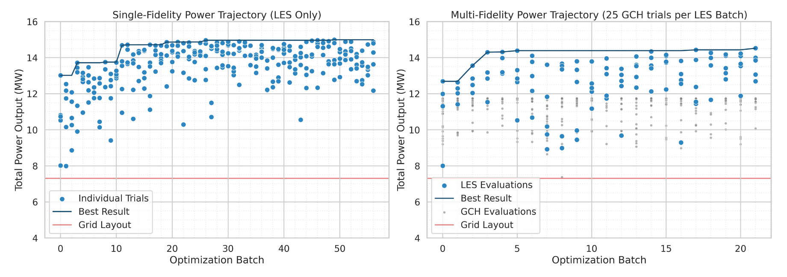
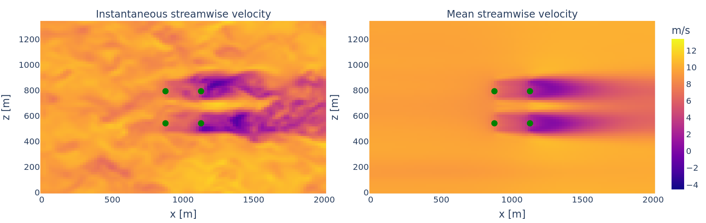

# windopt: Multi-Fidelity Wind Farm Layout Optimization

A framework for efficiently and accurately optimizing wind turbine layouts using Bayesian optimization, combining cheap analytical wake models with gold-standard large-eddy simulations.

## Overview

Wind farms produce more power when turbines are optimally positioned, but finding the best layout is challenging. Gold-standard approaches using high-fidelity large-eddy simulations (LES) are computationally expensive, while simplified analytical wake models may miss important flow physics.

This project *adaptively combines information* from both approaches to efficiently find optimal layouts.

Preliminary results indicate that the multi-fidelity approach can find **near-optimal layouts with significantly (60%) fewer** expensive LES evaluations compared to single-fidelity methods.


*Multi-fidelity optimization (right) reaches near-optimal designs in <20 simulations (4 batches), while single-fidelity LES optimization (left) requires 60+ simulations (12+ batches) to achieve similar performance. Both significantly outperform a standard grid layout (red line).*

The framework:
- Combines the approximate Gauss-curl hybrid (GCH) wake model with large-eddy simulations (LES)
- Employs multi-task and multi-fidelity Bayesian optimization to efficiently balance between fidelities
- Supports batch parallel evaluation of candidate layouts


## Requirements

- Python 3.10+
- Ax Platform 0.4.0+
- FLORIS 4.2.1+
- WInc3D (LES simulator)
- f90nml 1.4.4+
- seaborn 0.13.2+
- kaleido 0.2.1

WInc3D must be installed separately following instructions at [WInc3D repository](https://github.com/imperialcollegelondon/winc3d/).

## Usage

### Optimization
Optimization campaigns are run through a command-line interface:

```bash
# Start a new single-fidelity campaign using only LES
python -m windopt.optim.cli new my-campaign \
    --strategy les-only \
    --n-turbines 4 \
    --les-batch-size 5 \
    --max-les-batches 20

# Start a new multi-fidelity campaign alternating between GCH and LES
python -m windopt.optim.cli new my-mf-campaign \
    --strategy multi-alternating \
    --n-turbines 4 \
    --les-batch-size 4 \
    --gch-batch-size 50 \
    --gch-batches-per-les 1 \
    --max-les-batches 20

# Resume an existing campaign
python -m windopt.optim.cli restart my-campaign
```

The main optimization workflow consists of:

1. Running precursor simulations to generate inflow conditions
2. Evaluating candidate layouts using both GCH and LES models 
3. Fitting multi-task Gaussian processes to observations
4. Selecting new layouts via batch expected improvement

### Visualization

The package includes visualization utilities for analyzing wind farm simulations and optimization results:

```bash
# Plot instantaneous and mean velocity fields, where the instantanous field is taken 1 hour after spinup
python -m windopt.viz.velocity_flow run_dir 1.0 --save_path flow.png

# Create animated visualization of velocity field evolution
python -m windopt.viz.vector_field run_dir \
    --field ux \
    --start 0 \
    --n_steps 100 \
    --save anim.html
```


*Displayed: Instantaneous and mean streamwise velocity (in m/s) throughout a grid-layout wind farm.*

The visualization tools allow you to:
- Examine velocity field development through wind farms
- Understand wake interactions between turbines
- Monitor statistical convergence of simulations
- Track optimization campaign performance

## Limitations

- Currently supports optimization of up to 4 turbines as proof of concept
- Handles single wind direction/speed (extension to varying conditions planned)
- Uses fixed simulation durations (adaptive durations planned)
- Requires manual alternation between fidelities (automatic selection planned)

## Acknowledgements

- Prof. Nikos Bempedelis (Queen Mary University of London) for guidance on LES configuration
- Prof. John Cunningham (Columbia University) for Bayesian optimization guidance
- Columbia University's Terremoto computing cluster for computational resources

## Project Structure
```
.
├── campaigns/    # Optimization experiment results
├── config/       # Configuration files
├── data/         # Input data and initial samples
├── doc/          # Documentation and reports
├── src/
│   └── windopt/  # Main package
│       ├── config/     # Configuration handling
│       ├── initial/    # Initial sampling routines
│       ├── optim/      # Optimization implementations
│       ├── viz/        # Visualization utilities
│       └── winc3d/     # WInc3D LES interface
```
